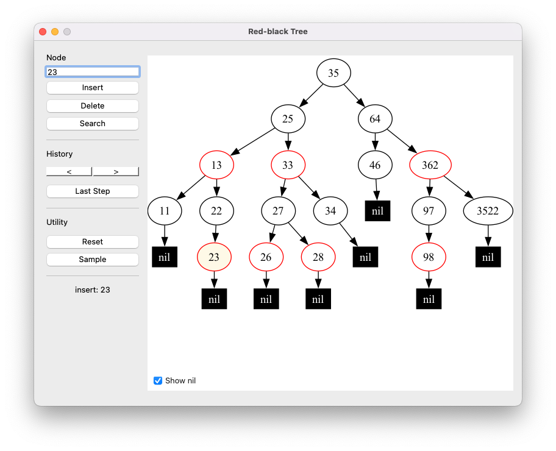

# red-black-tree
Red-black Tree Visualization in python



## Installation
1. Install Libraries
```
pip install PyQt5
```
```
pip install graphviz
```
2. Install Graphviz

(Windows)

2.1. Download [Graphviz 2.38](https://www2.graphviz.org/Archive/stable/windows/graphviz-2.38.msi) and install it. You need to copy paths of installed directories.

2.2. Add PATH system variable `[Your Graphviz Path]\bin` 
(ex. C:\Program Files (x86)\Graphviz2.38\bin).


3. run main.py
```
python3 main.py
```

##  Description

(Update soon...)

### rbtree
Main codes of Red-black Tree is modulized as 'rbtree'.
Inside of rbtree, every classes have inheritance.
```
RBTreeBase
└── RBTreeRotate
    ├── RBTreeInsert ┐
    └── RBTreeDelete ┴ RBTree
```

### gui

Code for Graphic User Interfaces, Initialized by main.py.

### draw_tree

Generate images from Tree.

### file_manager

Save, load, and manage temporary folders.
